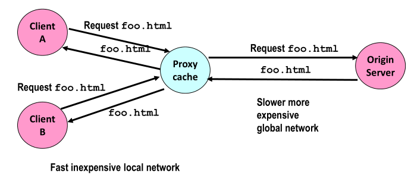
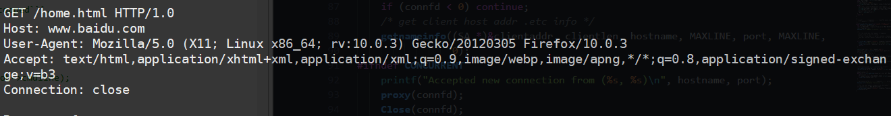
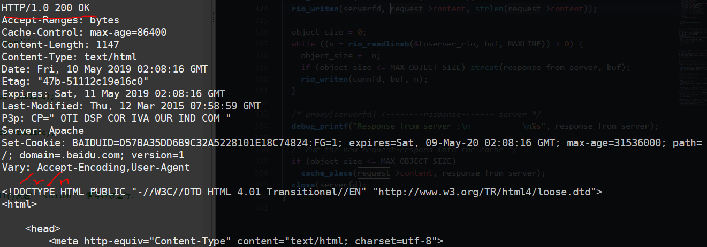
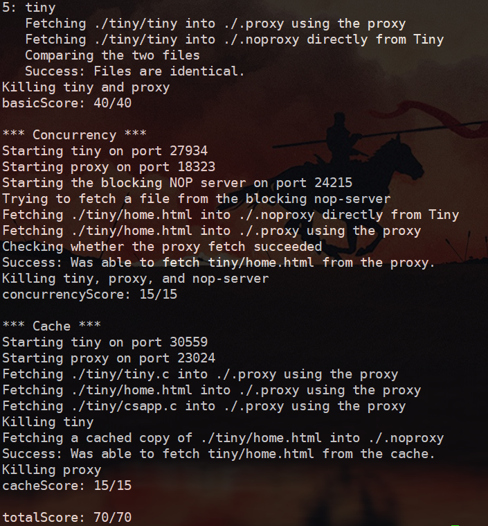

# proxy-lab
------------------
## 实验目的
 - partA: 运用```unix socket```,```http请求```知识,完成一个代理服务器.
 - partB: 给这个```proxy-server```添加多线程.
 - partC: 给这个```proxy-server```添加缓存```cache```.
## 实验材料及准备
 - 修改```proxy.c```,添加```cache.c/h```,修改```Makefile```
## 实验过程

### 概览
```proxy server```代理服务器,可以认为是一个位于客户端和服务器之间的一个服务器,即如下图所示.     


故```proxy```要完成以下几步:      
1. 接受```Client```的```request```,并必要时加工    
    ```Client ---(request)---> Proxy ```
2. 在```proxy-cache```中查找是否有对应```request```的缓存:   
如果有,则取出发送给```Client```:    
    ```Client <----(response)----- Proxy-Cache```      
如果没有,那么```proxy```将此```request```发给```Server```:     
    ``` proxy ---(request)---> Server```
3. 将从```Server```发过来的```response```转发给```Client```:   
```Client <---(response)--- proxy <---(response)--- Server```
如果此```response```过大,不宜缓存,就直接转发,否则就存在```Cache```中.


### 实验步骤
1. PartA: 基本的```proxy```     
对于基本的```proxy```,既要充当服务器,也要充当客户端.如下步骤:    
    1. 首先作为```Server```打开监听端口,得到```listenfd ```.   
        ```Client -------> (listenfd) Porxy```    

    2. ```accept```接受客户端的请求,得到```connfd```:    
        ```Client(clientfd) -----> (connfd)Proxy```    
        这样,通过这个```connfd```,获取```request```,并且把```response```转发给```client```.
        
    3. 解析```client```的```request```:
        - 首先是```request```,他包括一个```请求行```,和零个或多个```请求报头```. 并一个单独的```\r\n```结束```请求```.
        - 请求行和请求头部都以```\r\n```结尾
        - 请求行: ``` method host:port/path version```
        - 请求头部: ```header-name: header-data```
        - 即:    
            
        - 注意,一般只有```请求行```时,请求行中必须要是完整的uri,即:   
            ```GET http://www.baidu.com/home.html HTTP/1.1```   
            若有```Host:```头部,则可以只写```path```.
            
    4. 解析```server```的```response```:   
       - 与```requst```类似,```response```为一个```响应行```,后跟零个或多个```响应报头```,在跟一个终止```报头```的```\r\n```,最后是```响应主体(body)```,它也是请求的内容.    
       - ```响应行```: ```version status-code status-message```    
       - ```响应报头```: ```header-name: header-data```
       - ```响应主体```    
       - 即:    
            
2. PartA: 注意事项
    - 服务器程序是要保持一直运行的,故可以理解为即使有错,也不能轻易发生```unix_error()```,这样会导致程序停止.故我们不能使用```wrapper```包装好的函数.
    - 调用 ```Signal(SIGPIPE, SIG_IGN)```; 将 ```SIGPIPE``` 这个信号忽略掉。如果尝试两次发送数据到一个已经被对方关闭的 ```socket``` 上时，内核会发送一个 ```SIGPIPE``` 信号给程序，在默认情况下，会终止当前程序，显然不是我们想要的，所以要忽略它。这里有一个 stackoverflow 上的[相关问题](https://stackoverflow.com/questions/108183/how-to-prevent-sigpipes-or-handle-them-properly)。还有一点，往 ```broken pipe``` 里写会使 ```errno``` 等于 ```EPIPE```，而往 ```broken pipe``` 里读会使 ```errno``` 等于 ```ECONNRESET```。
    - 注意```listenfd```和```connfd```区别,并且不要忘记```close(fd)```.
    - 注意```strcpy```用法,可以参考我的[这篇博客](https://blog.csdn.net/WJSZMD/article/details/90044530)

3. PartB: 实现多线程+缓存
    1. 先说缓存:  缓存采用```LRU```机制,这里我们用```双向链表```实现```Cache```
        - ```node```为:```key```,```value```类似```map```的结构.
        - 最近使用的```node```,包括```读```,```写```放在队列头.
        - 如果要缓存的内容过大,超过一个```node```最大容量,就不缓存,直接转发.如果```Cache```容量要满了,就替换一个合适的```node```.
    2. 再说多线程对缓存的读写问题:  这是一个典型的```读写者```问题,我们采取```读者优先```.
        - 多个线程可以去```读Cache```,但只能有一个```写Cache```.
        - 写者不能抢占读者,必须等读者全读完.
        - 在多个线程去```读Cache```的时候,由于要进行```LRU```机制,即需要修改```Cache```链表,故还需一个信号量去控制,只能有一个```读线程```修改```Cache```.
        - ```Cache```在进程退出时,要```free内存```
    3. 再说多线程:
        - 每个```thread```都是```detached```分离的,这样线程终止时会自动释放资源.
        - 注意每个线程的传参问题,即传递```connfd```时,要对每一个```thread```都要```malloc```一块,存放当前```connfd```的值.不能直接传```&connfd```,由于```connfd变量```是共享的这样做错误.
        - 线程函数退出前要```close(fd)```.
4. 调试方案
    1. telnet
        - 不安全的 ssh，需要手动构造 HTTP 请求，如果想要测试非法的 header，这个功能就很有用
        - telnet www.baidu.com 80
        - GET http://www.baidu.com:80/home.html HTTP/1.1
    2. curl
        - 会自动构建 HTTP 请求
        - 有代理模式,测试你的```proxy```时有用
        - curl --proxy localhost:3092 http://www.baidu.com
    3. netcat
        - 多用途网络工具，用法与 ```telnet``` 类似
        - nc catshark.ics.cs.cmu.edu 12345
        - GET http://www.cmu.edu/hub/index.html HTTP/1.0
        
## 实验结果


## 实验总结
这个```lab```是一个综合型的```lab```,把```Cache```,```Concurrent Programming```, ```Web```等综合一起,笔者认为都需要好好动手完成.